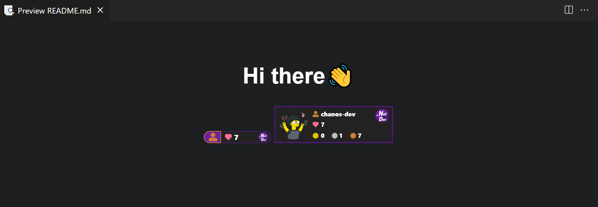
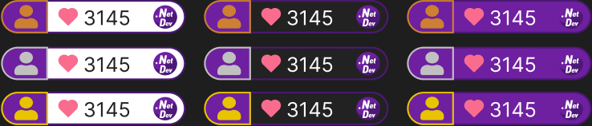
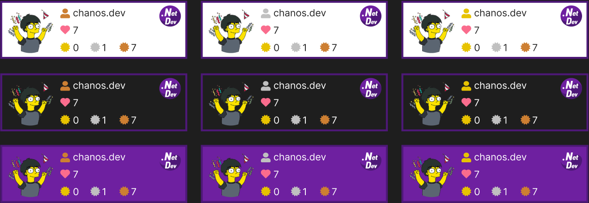

## 🧷 dotnetdev badge:
   
- `README.md`를 통해 [닷넷데브 포럼](https://forum.dotnetdev.kr) 프로필을 공유해보세요!
- 업데이트는 하루로 설정되어 있습니다.
  - `cache-control=max-age=86400`

- 사용모습

  

--- 

### ⭐ badge 사용:

#### ✔ small badge:

##### API - v1 
```
https://profile.dotnetdev-badge.kr/api/v1/badge/small?id={id}&theme={Light,Dark,Dotnet}
```
> parameter - query string

| parameter |  default  | description                                                                |
| :------ | :-------: | :------------------------------------------------------------------------- |
| `id` | - | 닷넷데브 포럼 `사용자 이름` |
| `theme` | `Light` | 뱃지 테마 (`Light`, `Dark`, `Dotnet`) |



<details>
<summary>샘플</summary>

```
-- md
[](https://forum.dotnetdev.kr/u/{id}/summary)

-- html 
<a href="https://forum.dotnetdev.kr/u/{id}/summary">
    
</a>
```
[](https://forum.dotnetdev.kr/u/chanos-dev/summary)

</details>   

#### ✔ medium badge:
##### API - v1
```
https://profile.dotnetdev-badge.kr/api/v1/badge/medium?id={id}&theme={Light,Dark,Dotnet}
```
> parameter - query string

| parameter |  default  | description                                                                |
| :------ | :-------: | :------------------------------------------------------------------------- |
| `id` | - | 닷넷데브 포럼 `사용자 이름` |
| `theme` | `Light` | 뱃지 테마 (`Light`, `Dark`, `Dotnet`) |



<details>
<summary>샘플</summary>

```
-- md
[](https://forum.dotnetdev.kr/u/{id}/summary)

-- html 
<a href="https://forum.dotnetdev.kr/u/{id}/summary">
    
</a>
```

[](https://forum.dotnetdev.kr/u/chanos-dev/summary)

</details>